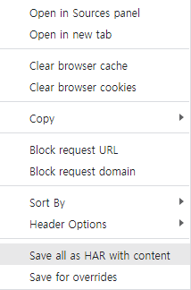

# 이미지 다운로드(har, python, js 사용)

> 로그인이 필요한 사이트에서 DevTools로 이미지를 다운받는 방법은 조금 까다로웠다. 가장 쉽게 할 수 있는 방법을 찾아보았다.

## 사용법

- F12를 눌러 DevTools를 실행

- Network 탭으로 이동

- 페이지 새로고침

- 이미지 전체 로드(스크롤을 내리는 등의 방법으로)

  

- 우클릭 -> `Save all as HAR with content` 클릭하여 har 파일 추출(파일 이름은 `source_har.har`로 세팅)

- 클론받은 폴더와 같은 위치에 har 파일 이동

- `get_image_urls.py` 실행, `image_urls.txt` 파일 생성되는지 확인

- DevTools Console에 `images_download.js` 코드 붙여넣고 엔터

- DevTools Console에 `image_urls.txt` 내용 붙여넣고 엔터

- 크롬에서 설정한 다운로드 폴더 위치에 이미지가 한장씩 다운로드됨

